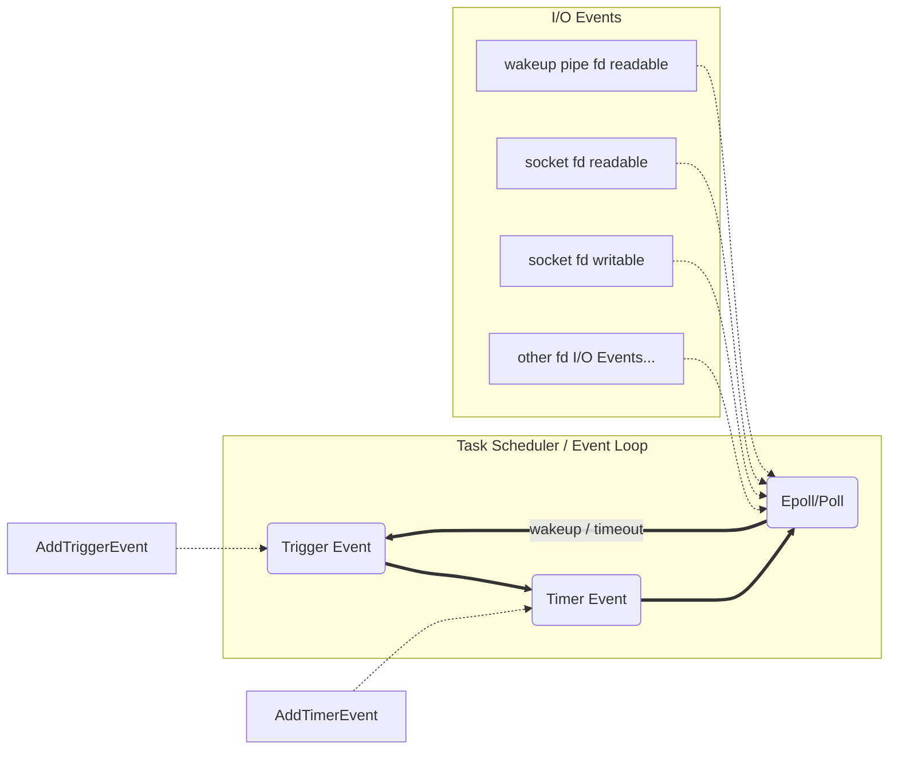
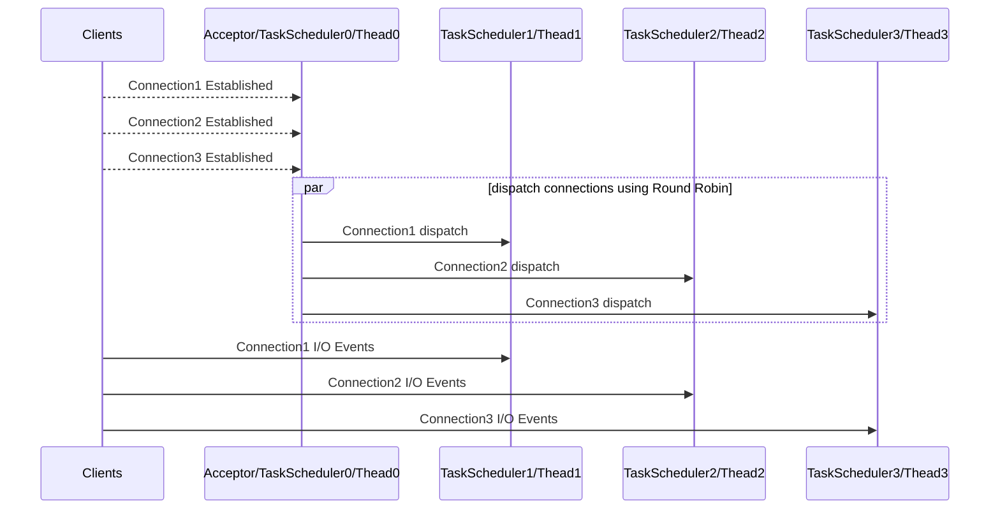
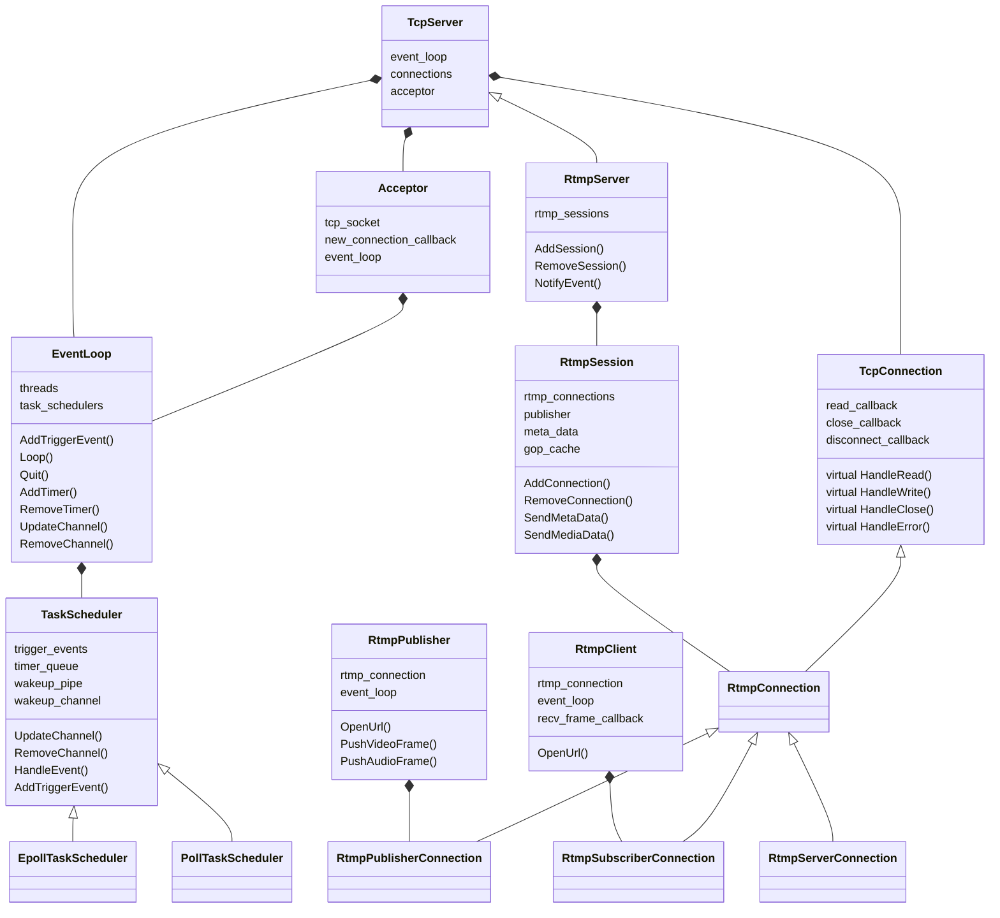
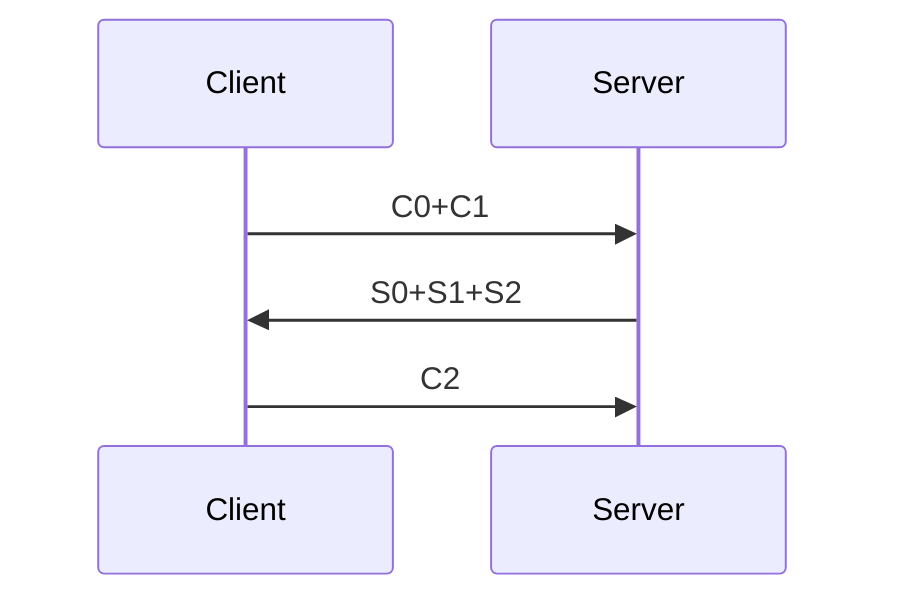
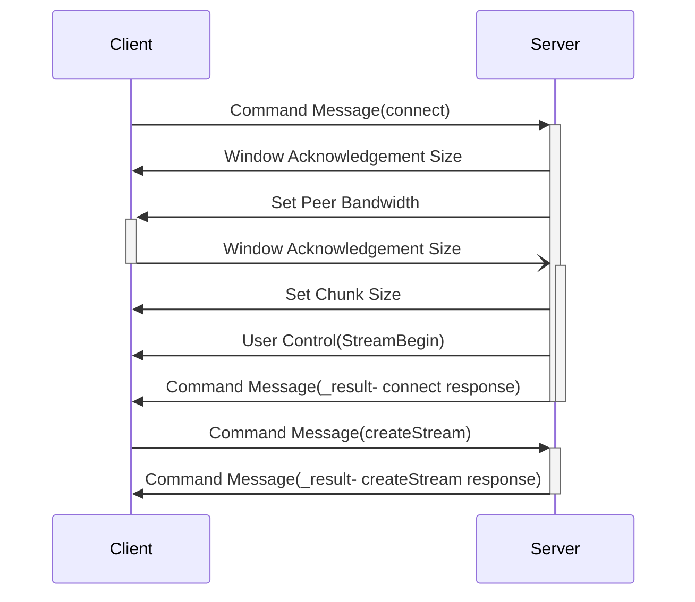
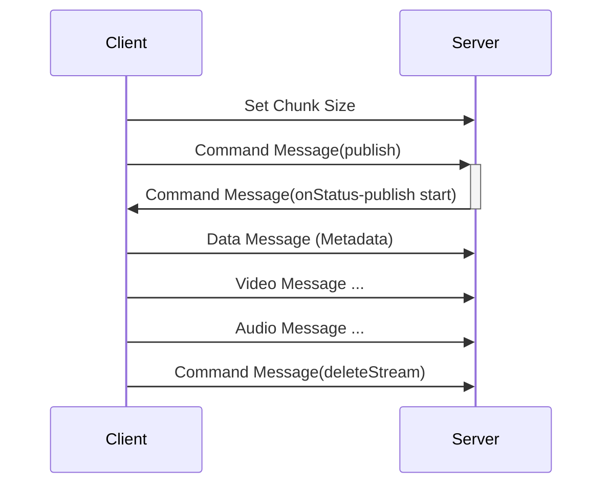
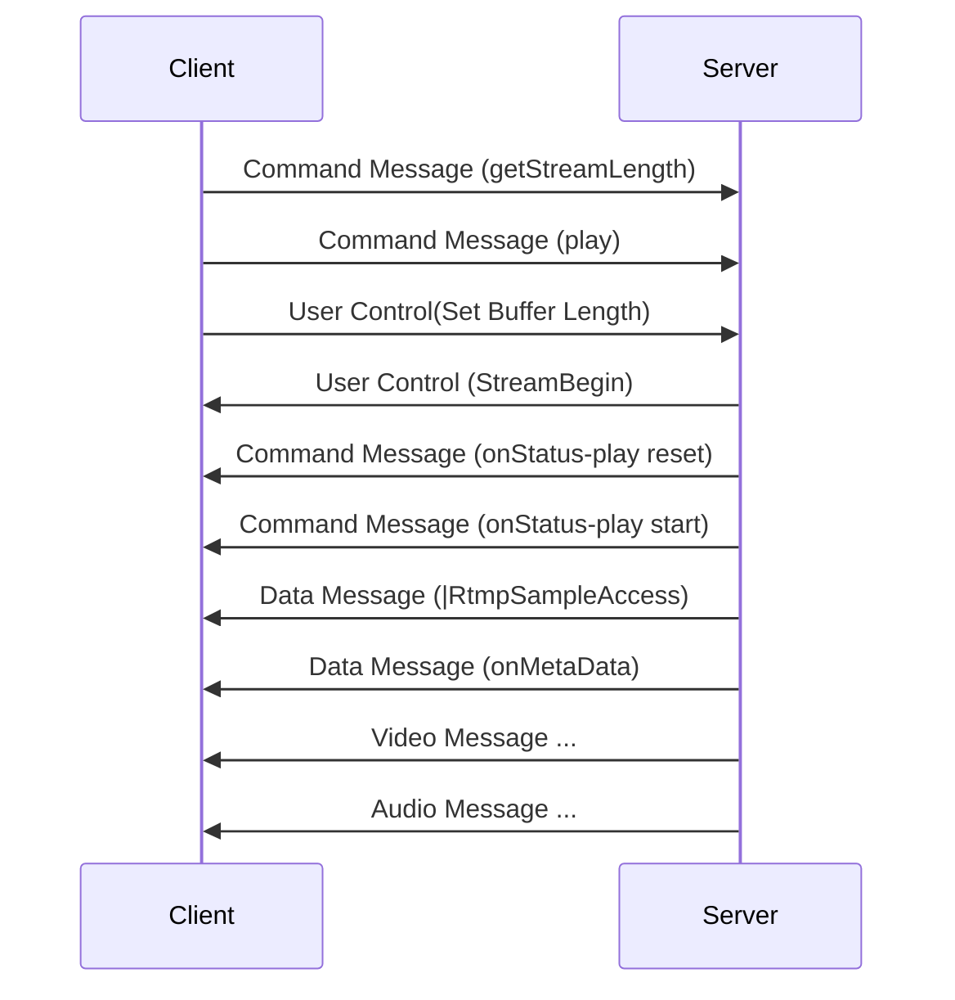

# RTMP 服务器
C++11 实现的无第三方依赖的 RTMP 服务器, 支持 H.264 和 AAC 转发, 支持 GOP 缓存, 同时附带支持 RTMP 推流和拉流的简易客户端封装.

## 构建和测试
### 环境要求
- Linux Kernel 2.6+, 在 Ubuntu 22.04 和 CentOS 7.9 上测试正常
- 支持 C++14 的编译器: g++ 版本 5.5+ 或 clang++ 版本 3.4+
- CMake 3.10

### 构建示例
```bash
git clone https://github.com/lgder/rtmp.git
cd rtmp
mkdir build && cd build
cmake ..
make -j$(nproc)
./rtmp_server
./test_all  # 单元测试
```

### 测试示例

- 推流到服务器 
  ```bash
  ffmpeg.exe -re -i test.h264 -f flv rtmp://127.0.0.1/live/stream0
  ```

- 从服务器拉流
  ```bash
  ffplay.exe rtmp://127.0.0.1/live/stream0
  ```

- build 目录下运行单元测试
  ```bash
  ./test_all
  ```


## 压力测试
- 服务器配置：Intel(R) Xeon(R) CPU E5-2609 v4 @ 1.70GHz 8核8线程 \* 2, 32G 内存;
- 压测工具：[Go语言编写的 lal](https://github.com/q191201771/lal) 的 `/app/demo/pushrtmp` 以及 `/app/demo/pullrtmp`;
- 使用测试文件平均码率：206 kbps;
- 压测工具和测试机器在同一台机器上, 日志正常输出.


**测试场景一: 持续推送 n 路流到服务器, 不拉取流**

| 推流数量 | CPU占用 (Solaris Mode) | 内存占用（RES） |
| -------- | ---------------------- | --------------- |
| 1000     | 1.4%                   | 80.2  MB        |
| 5000     | 5.3%                   | 290.9 MB        |
| 10000    | 11.9%                  | 545.4 MB        |


**测试场景二: 持续推送 1 路流到服务器, 同时拉取 n 路流**

| 拉流数量 | CPU占用 (Solaris Mode) | 内存占用（RES） |
| -------- | ---------------------- | --------------- |
| 1000     | 4.1%                   | 40.5  MB        |
| 5000     | 17.1%                  | 88.7  MB        |
| 10000    | 32.1%                  | 148.5 MB        |


**测试场景三: 持续推送 n 路流到服务器, 同时一对一拉取 n 路流**

| 推/拉流数量 | CPU占用 (Solaris Mode) | 内存占用（RES） |
| ----------- | ---------------------- | --------------- |
| 1000        | 5.7%                   | 96.5  MB        |
| 5000        | 19.5%                  | 740.2 MB        |
| 10000       | 34.7%                  | 1.8   GB        |


## 项目结构

### 目录结构
```plain
.
├── RtmpPush   测试用 Android 平台 RTMP 推流客户端
├── benchmark  压力测试
├── gtest      单元测试
├── src        源码目录
│   ├── main.cc   服务器入口
│   ├── net       参照 Muduo 实现的轻量级网络库
│   ├── rtmp      RTMP 协议相关文件
│   └── utils     工具类
└── test.h264  测试用的 raw H.264 视频文件
```

### 网络库封装
参考 Muduo 库实现一个简易的事件循环为核心的 TCP 网络库.

事件循环: TaskScheduler (Muduo 中的 EventLoop).  
每个 TaskScheduler 对应一个独立的线程, 线程中轮流处理 I/O 事件, 触发事件和定时事件.  
其中 I/O 多路复用的阻塞等待超时时间为 Timer Event 下一个元素的剩余触发时间, 如无定时事件, 则一直阻塞等待 I/O 事件到达, 这其中可以通过对 wakeup pipe 进行写操作来从阻塞等待中唤醒.



使用 Reactor 半同步半反应堆模型, 在主线程的 TaskScheduler 中注册监听新连接, 连接到达时使用 Round Robin 算法将新连接分发给工作线程. 工作线程也各自拥有事件循环, 接收新连接时将连接的文件描述符绑定到各自的 epoll 上响应网络 I/O 事件, 并可以接收定时事件和触发事件.




与 Muduo 不同的是, 项目中没有使用 `EventLoopPool` 而是将事件循环拆到更小粒度的 `TaskScheduler` 中, 单线程的时候 `EventPool` 即为事件循环, 多线程的时候 `EventPool` 为多个事件循环的集合 `task_schedulers`, 其中 `EventPool` 上原来的接口对应 `task_schedulers[0]`, 用于监听新连接主循环, 并将新连接分发给各个工作线程的事件循环. 在使用 `EventLoopPool` 时, 多线程和单线程接口一致.


### 整体结构

省略一些和结构无关的仅做辅助功能的类, 以及一些不重要的字段, 整体简略的类图如下:


其中:
- `EventLoop` 单线程的时候就是事件循环等同于 `TaskScheduler`, 多线程的时候负责管理 `TaskScheduler` 的集合, `TaskScheduler` 内部是真正的事件循环, 根据 I/O 多路复用的实现分为两个子类;

- `RtmpServer` 用来管理 `RtmpSession` 和 `Acceptor`, 最先被初始化, 是服务器的控制中心, 并在连接到达或者断开, `session` 建立和删除的时候可以调用回调函数通知事件;

- `RtmpSession` 用来管理一个 RTMP 流, 对应一个 RTMP 流的发布者和多个订阅者, 负责转发流信息以及保存 GOP 缓存等;

- `RtmpConnection` 是发布者或者订阅者的客户端连接, 其三个子类设计上是子类, 但在实际实现中都写在 `RtmpConnection` 中, 通过 `RtmpConnection` 的 `connection_mode_` 字段来区分;

- `RtmpPublisher` 是推流的简单封装, `RtmpClient` 是拉流的简单封装且仅输出收到的视频帧信息, 这两个类仅用于测试和调试.


## RTMP 通信过程

实际实现和官方文档有一些不同, 主要通过对 ffmpeg, ffplay 和 [nginx-rtmp-module](https://github.com/arut/nginx-rtmp-module) 之间的通信抓包来分析实际的过程, 然后在此基础上实现的服务器业务逻辑, 以下实际实现和文档对比分析.

### 握手
---
官方文档中的握手过程
```plain
+-------------+                           +-------------+
|    Client   |       TCP/IP Network      |    Server   |
+-------------+            |              +-------------+
      |                    |                     |
 Uninitialized             |               Uninitialized
      |          C0        |                     |
      |------------------->|         C0          |
      |                    |-------------------->|
      |          C1        |                     |
      |------------------->|         S0          |
      |                    |<--------------------|
      |                    |         S1          |
 Version sent              |<--------------------|
      |          S0        |                     |
      |<-------------------|                     |
      |          S1        |                     |
      |<-------------------|                Version sent
      |                    |         C1          |
      |                    |-------------------->|
      |          C2        |                     |
      |------------------->|         S2          |
      |                    |<--------------------|
   Ack sent                |                  Ack Sent
      |          S2        |                     |
      |<-------------------|                     |
      |                    |         C2          |
      |                    |-------------------->|
 Handshake Done            |               Handshake Done
      |                    |                     |
```

理论的实现: 
1. 客户端发送 C0, C1, 两个单独发送;
2. 服务器收到任意 C0 或者 C1 发送 S0S1, 合并发送;
3. 客户端收到 S0S1, 发送 C2; 服务器收到 C0 和 C1 后发送 S2;
4. 客户端和服务器分别收到 S2 和 C2 后，握手完成;
总计发送 C0, C1, S0S1, C2, S2 五个包;


实际实现一般都是合并发送:

1. 客户端发送 C0C1, 两个直接合并;
2. 服务端收到 C0C1 之后, 发送S0S1S2, 三个直接合并;
3. 客户端收到 S0S1S2 之后, 发送 C2, 客户端握手完毕;
4. 服务端收到 C2, 服务端握手完毕.
总计发送 C0C1, S0S1S2, C2 三个包

若按照 MTU 大小为 1500 字节来算, 减去 20 字节的 TCP 头和 20 字节的 IP 头, MSS 就是 1460 字节.
那么实际实现拆分为:
- C0C1: 1+1536 Byte, 分成 1460 + 77
- S0S1S2: 1+1536+1536 Byte, 分成 1460 + 1460 + 153
- C2: 1536 = 1460 + 76  
实际实现共发送 7 个数据包

理论实现可以拆分为: 
- C0:   1    = 1
- C1:   1536 = 1460 + 76
- S0S1: 1537 = 1460 + 77
- C2:   1536 = 1460 + 76
- S2:   1536 = 1460 + 76  
理论实现共发送 9 个数据包

MTU 更大的情况下, 实际实现更有优势

### 建立连接和建立流 
---

官方文档的建立连接和建立流过程
```plain
          +------------+                        +-----------+
          |   Client   |           |            |   Server  |
          +-----+------+           |            +-----+-----+
                |           Handshaking Done          |
                |                  |                  |
                |                  |                  |
       ---+---- |----- Command Message(connect) ----->|
          |     |                                     |
          |     |<----- Window Acknowledge Size ------|
  Connect |     |                                     |
          |     |<------ Set Peer BandWidth ----------|
          |     |                                     |
          |     |------ Window Acknowledge Size ----->|
          |     |                                     |
          |     |<----- User Control(StreamBegin) ----|
          |     |                                     |
       ---+---- |<-------- Command Message -----------|
                |   (_result- connect response)       |
                |                                     |
       ---+---- |--- Command Message(createStream) -->|
   Create |     |                                     |
   Stream |     |                                     |
       ---+---- |<------- Command Message ------------|
                | (_result- createStream response)    |
                |                                     |
```

1. 客户端发送控制消息 `connect`, 请求与一个服务应用实例建立连接;

2. 服务器接收连接控制消息之后, 发送窗口回复阈值消息 `Window Acknowledge Size` 到客户端, 同时连接请求中相应的程序, 这里就是 `connect` 中的 `app` 字段;

3. 服务器发送设置对等带宽消息 `Set Peer BandWidth` 到客户端;

4. 客户端处理设置带宽协议消息后, 发送窗口回复阈值消息 `Window Acknowledge Size` 到服务器端;

5. 服务器发送 `Stream Begin` 的用户控制消息 `User Control` 到客户端;

6. 服务器发送控制消息 `_result`, 通知客户端连接状态.


实际实现:



主要细节上的区别在于:
- 服务器接收连接控制消息之后, 按顺序直接发送 `Window Acknowledge Size`, `Set Peer Bandwidth`, `Set Chunk Size`, `User Control(StreamBegin)`, `_result` 到客户端; 客户端收到 `Set Peer Bandwidth` 之后发送 `Window Acknowledge Size` 到服务器端的时候和之前服务器发送的流程分开, 异步处理, `Window Acknowledge Size` 对服务器建立当前连接的过程并不重要, 延迟设置无影响. 实际上在抓包过程中客户端返回 `Window Acknowledge Size` 消息之后可能不等 `_result` 消息就直接发送 `createStream` 控制消息;

- 中间多一个 `Set Chunk Size` 的消息, 可以选择设置一个较大的 chunk size, 以减少 chunk header 的开销并降低 CPU 占用, 但是可能会增加延迟.


### Publish
官方文档的发布流过程, 给的信息太少而且和实际实现有较大区别:
```plain
     +--------------------+                     +-----------+
     |  Publisher Client  |       |             |   Server  |
     +----------+---------+       |             +-----+-----+
                |          createStream done          |
                |                 |                   |
                |                 |                   |
                |                 |                   |
       ---+---- |---- Command Message(publish) ------>|
          |     |                                     |
          |     |<----- User Control(StreamBegin) ----|
          |     |                                     |
          |     |---- Data Message (Metadata) ------->|
          |     |                                     |
Publishing|     |------------ Audio Data ------------>|
  Content |     |                                     |
          |     |------------ SetChunkSize ---------->|
          |     |                                     |
          |     |<--------- Command Message ----------|
          |     |      (_result- publish result)      |
          |     |                                     |
          |     |------------- Video Data ----------->|
          |     |                  |                  |
          |     |                  |                  |
                |    Until the stream is complete     |
                |                  |                  |
```

1. 发送控制消息 `publish` 到服务器, 请求发布一个流;
2. 服务器接收到 `publish` 消息之后, 发送 `StreamBegin` 的用户控制消息;
3. 客户端发送 `Metadata` 的数据消息, 告知元数据;
4. 客户端发送一个空的 `Audio Data`;
5. 客户端发送 `Set Chunk Size` 消息设置客户端发送的分块大小;
6. 服务器发送 `_result` 的控制消息;
7. 客户端发送 `Video Data` 和 `Audio Data` 直到流结束.


实际实现


主要区别在于:
- 客户端可能在 `publish` 之前或之后发送 `Set Chunk Size` 消息设置客户端发送的分块大小, 不一定按照官方文档的顺序;
- 抓包发现服务器端可以无需返回 `StreamBegin` 的用户控制消息, 推测是这在推流中不是必须, 拉流中可能需要;
- 服务端不返回 `_result` 的控制消息, 检查无错误就返回 `onStatus` 且 `code` 字段为 `NetStream.Publish.Start` 的控制消息, 然后之后都直到流结束只接收数据不返回;
- 客户端收到 `onStatus` 的控制消息之后首先会发送元数据才会发送音视频数据.


### Play
```plain
     +-------------+                            +------------+
     | Play Client |             |              |   Server   |
     +------+------+             |              +------+-----+
            |             createStream done            |
            |                    |                     |
            |                    |                     |
            |                    |                     |
   ---+---- |------ Command Message (play) ----------->|
      |     |                                          |
      |     |<------------- SetChunkSize --------------|
      |     |                                          |
      |     |<---- User Control (StreamIsRecorded) ----|
 Play |     |                                          |
      |     |<---- User Control (StreamBegin) ---------|
      |     |                                          |
      |     |<- Command Message(onStatus-play reset) --|
      |     |                                          |
      |     |<- Command Message(onStatus-play start) --|
      |     |                                          |
      |     |<------------ Audio Message --------------|
      |     |                                          |
      |     |<------------ Video Message --------------|
      |     |                    |                     |
                                 |
        Keep receiving audio and video stream till finishes
```
1. 发送控制消息 `play` 到服务器, 请求播放一个流;
2. 服务器接收到 `play` 消息之后, 发送 `Set Chunk Size`;
3. 服务器发送 `StreamIsRecorded` 和 `StreamBegin` 的用户控制消息;
4. 服务器发送 `onStatus-play reset` 和 `onStatus-play start` 的控制消息;
5. 服务器发送 `Audio Message` 和 `Video Message` 的数据消息, 直到流结束.


实际实现



主要区别在于:
- 客户端在 `play` 之前使用 `getStreamLength` 消息获取流长度, 但是服务器端并没有实现这个功能, 所以服务器端直接忽略这个消息;
- 客户端在 `play` 之后发送 `Set Buffer Length` 的用户控制消息, 目的是告知服务器端客户端的缓冲区大小, 但是服务器端也没有实现这个功能, 所以服务器端直接忽略这个消息;
- 服务器端没有 `Set Chunk Size` 消息了, 因为在建立连接的时候已经发送过设置过了;
- 服务器端无需 `StreamIsRecorded` 的用户控制消息, 因为服务器端没有实现录制流;
- 需要发送 `Data Message (|RtmpSampleAccess)` 消息, 设置客户端不能音频和视频样本上进行随机访问;
- 还需要发送 `Data Message (onMetaData)` 消息, 告知元数据, 有了这些元数据客户端才能开始播放.


## 参考资料
---

[RTMP 官方英文文档](https://ossrs.io/lts/en-us/assets/files/rtmp_specification_1.0-25a467618b92a3115bc97d4b0038b0ff.pdf) 

[AMF0 官方文档](https://rtmp.veriskope.com/pdf/amf0-file-format-specification.pdf)

[RTMP规范（重新整理版）](https://juejin.cn/post/7115064925885562916#heading-0)

[Muduo](https://github.com/chenshuo/muduo/)

[Linux多线程服务端编程 使用muduo C++网络库](https://chenshuo.com/book/)

[RtmpDump](https://github.com/mstorsjo/rtmpdump)

[nginx-rtmp-module](https://github.com/arut/nginx-rtmp-module)

[crtmpserver](https://github.com/shiretu/crtmpserver)

[雷霄骅博客](https://blog.csdn.net/leixiaohua1020/category_8432890.html)

[RTMP协议详解](https://mp.weixin.qq.com/mp/appmsgalbum?__biz=MzAwODM5OTM2Ng==&action=getalbum&album_id=1501980279110991874&)

[VABlog](https://github.com/xhunmon/VABlog)

[LAL: Golang audio/video live streaming library/client/server](https://github.com/q191201771/lal)

[罗上文 - FFmpeg原理](https://ffmpeg.xianwaizhiyin.net/)
